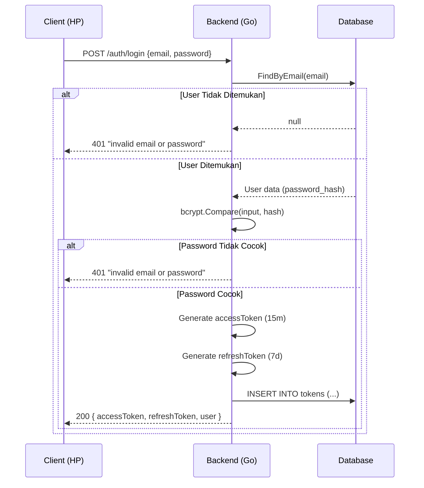
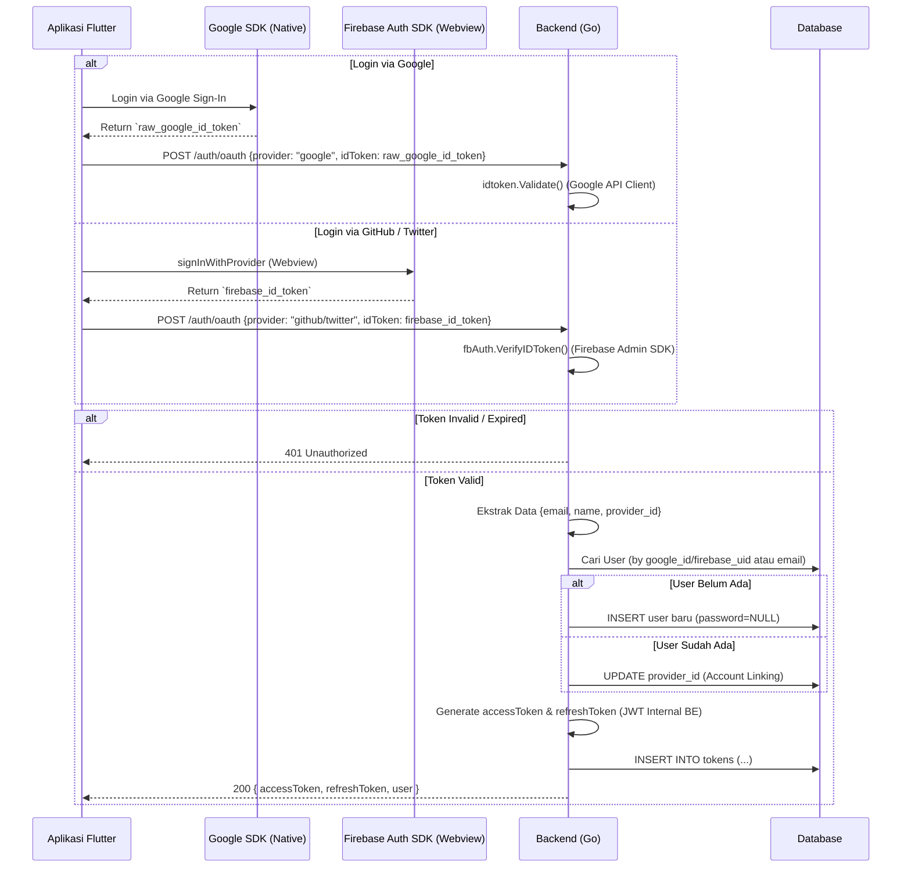
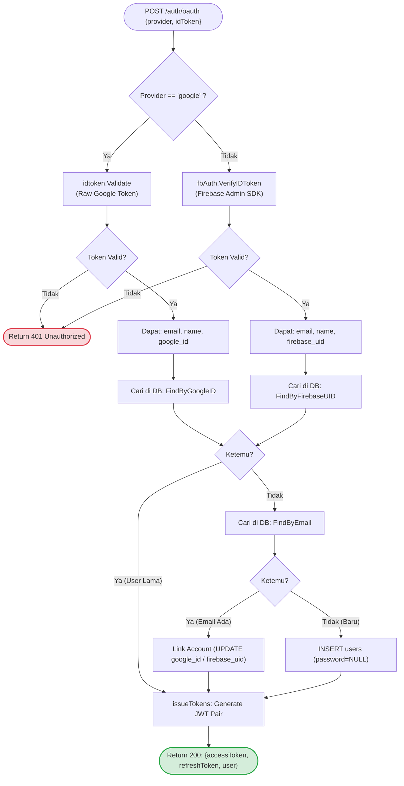
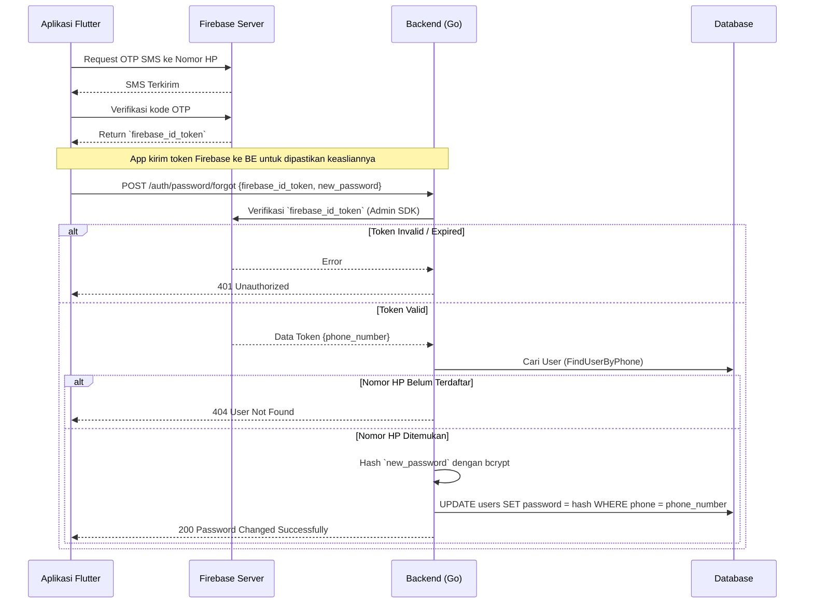

# Authentication Architecture & Logic

## 1. Bagaimana Token Bekerja (Fondasi)

1. User login → BE verifikasi credential → BE buat JWT pair
2. JWT pair disimpan di tabel `tokens` (BE) DAN di SecureStorage (HP)
3. Setiap request ke protected endpoint:
   - HP kirim: `Authorization: Bearer <accessToken>`
   - BE match token dengan DB → valid → proses request
4. `accessToken` expired (15 menit):
   - HP kirim `refreshToken` ke `POST /auth/refresh`
   - BE revoke token lama di DB → issue token pair baru
   - HP simpan token baru, lanjut request
5. `refreshToken` expired (7 hari) → paksa logout → user login ulang

> Password di DB adalah **bcrypt hash**, bukan teks asli.
> BE tidak pernah tahu password asli — hanya membandingkan hash.

### Visualisasi Penyimpanan Token

Setelah login sukses, token disimpan di dua tempat:

**1. Di Database (Backend):** Tabel `tokens`
| id | user_id | access_token | refresh_token | is_revoked | access_expiry |
|----|---------|--------------|---------------|------------|---------------|
| 1  | 10      | `eyJhbG...`  | `eyJhbG...`   | `false`    | `10:15:00`    |

**2. Di SecureStorage (HP/Client):**
| Key | Value |
|-----|-------|
| `access_token` | `eyJhbG...` |
| `refresh_token` | `eyJhbG...` |

---

## 2. Email/Password Login — Internal Flow

### 2.1. Sequence Diagram (Interaksi Komponen)


### 2.2. Flowchart Logic (Logika Percabangan)


---

## 3. Hybrid OAuth Social Login Architecture (Google, GitHub, Twitter)

Aplikasi ini sengaja menggunakan arsitektur **Hybrid** untuk Social Login guna mengatasi masalah dependensi dan memastikan keandalan di semua platform (Android & iOS).

### 3.1. Mengapa Hybrid?
1. **Google Sign-In (Native):** Menggunakan package `google_sign_in` yang berkomunikasi langsung dengan Google Play Services (Android) dan Apple Authentication (iOS). Ini memberikan UX terbaik tanpa perlu membuka browser (Webview). Token yang didapat adalah **Raw Google ID Token**.
2. **GitHub & Twitter (Firebase Auth):** Menggunakan package `firebase_auth` yang memunculkan Webview (Chrome Custom Tabs / Safari View Controller). Keduanya disatukan oleh Firebase, sehingga aplikasi tidak perlu repot menyimpan puluhan *client secret*. Token yang didapat adalah **Firebase ID Token**.

### 3.2. Sequence Diagram (Interaksi Komponen)


### 3.3. Flowchart Logic (Validasi Backend)


> **Catatan Penting:** Meskipun metodenya (Native vs Firebase) berbeda di *frontend* dan *backend*, hasil akhirnya tetap sama: Backend memberikan **Internal JWT Access Token**. Aplikasi Flutter tidak peduli user login lewat jalur apa, JWT yang diterima tetap diperlakukan sama untuk request ke endpoint lain.

---

## 4. DB Migration untuk Unified Firebase Social Login

```sql
-- Migration: 011_add_oauth_support.sql (Versi Awal)
-- ... [Disembunyikan untuk keringkasan] ...

-- Migration: 013_add_firebase_uid.sql (Versi Unified)
ALTER TABLE users ADD COLUMN IF NOT EXISTS firebase_uid VARCHAR(255) UNIQUE DEFAULT NULL;
CREATE INDEX IF NOT EXISTS idx_users_firebase_uid ON users (firebase_uid);

-- Update constraint untuk mendukung twitter
ALTER TABLE users DROP CONSTRAINT IF EXISTS chk_auth_provider;
ALTER TABLE users ADD CONSTRAINT chk_auth_provider
    CHECK (auth_provider IN ('local', 'google', 'apple', 'github', 'twitter'));
```

**Kolom relevan di tabel `users`:**

| Kolom | Tipe | Keterangan |
|-------|------|------------|
| `password` | TEXT **NULL** | Diubah dari NOT NULL — NULL untuk social user |
| `firebase_uid` | VARCHAR(255) UNIQUE NULL | `uid` dari Firebase Admin SDK |
| `auth_provider` | VARCHAR(20) DEFAULT 'local' | `local` / `google` / `apple` / `github` / `twitter` |

---

## 5. Lupa Password (Forgot Password) via Firebase OTP

Fitur ini mengizinkan pengguna yang tidak bisa login (lupa password) untuk mereset password mereka dengan melakukan verifikasi nomor HP menggunakan **Firebase Phone Auth** (OTP SMS). Ini adalah API Public (tanpa Bearer Token) karena user dalam kondisi belum login.

### 5.1. Syarat Infrastruktur
- Menggunakan **Firebase Admin SDK** di Backend Go (`firebase.google.com/go/v4`).
- Tabel `users` wajib memiliki kolom `phone` yang terisi dengan format E.164 (contoh: `+628111111111`).

### 5.2. Sequence Diagram (Interaksi Komponen)



### 5.3. Flowchart Logic


### 5.4. Bagaimana Backend Go Memverifikasi Token Firebase?

Salah satu pertanyaan kritis adalah: *"Jika Backend Go tidak pernah menyimpan `firebase_id_token` dari OTP di database, bagaimana cara Go mencocokkannya?"*

Jawabannya adalah: **Go tidak mencocokkan token, melainkan memverifikasi Tanda Tangan Kriptografi (Digital Signature).**

`idToken` Firebase adalah sebuah JWT (JSON Web Token) yang dibentuk oleh konsep Kriptografi Asimetris.
1. **Firebase Membuat Surat:** Setelah user memasukkan OTP yang benar di aplikasi Flutter, Firebase membuatkan `idToken` (surat keterangan) yang berisi nomor HP user.
2. **Stempel Emas (Private Key):** Firebase memberikan "stempel emas" pada surat tersebut menggunakan *Private Key* yang hanya dimiliki oleh Google.
3. **Go Mengecek Keaslian (Public Key):** Aplikasi Flutter mengirim surat ini ke Backend Go. Menggunakan **Firebase Admin SDK**, Backend Go men-download buku panduan *Public Key* milik Google dari internet. Go secara matematis mengecek apakah "stempel emas" di surat tersebut benar-benar dicetak oleh Google dan belum kedaluwarsa.
4. **Ekstrak Nomor HP:** Jika stempelnya terbukti asli (Valid), Go akan mengambil informasi nomor HP dari dalam surat tersebut (misal: `+628111111111`). Surat/token tersebut kemudian dibuang.
5. **Pencarian Database:** Langkah terakhir, Backend Go mencari di tabel `users` miliknya sendiri: `SELECT * FROM users WHERE phone = '+628111111111'`. Jika user ditemukan, password-nya akan diubah.

Dengan arsitektur ini, Backend Go tidak perlu repot menyimpan kode OTP atau token verifikasi. Semua beban verifikasi OTP (pengiriman SMS dan validasi kode angka) di-*outsource* sepenuhnya ke infrastruktur Firebase.

