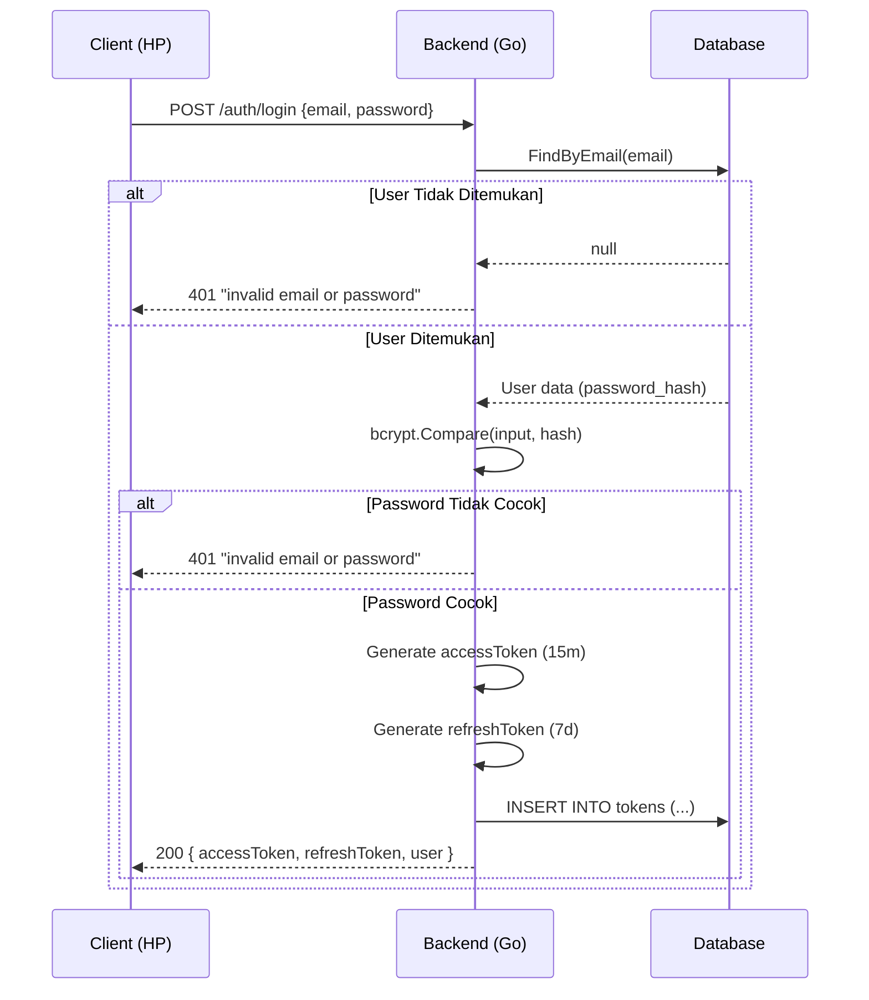
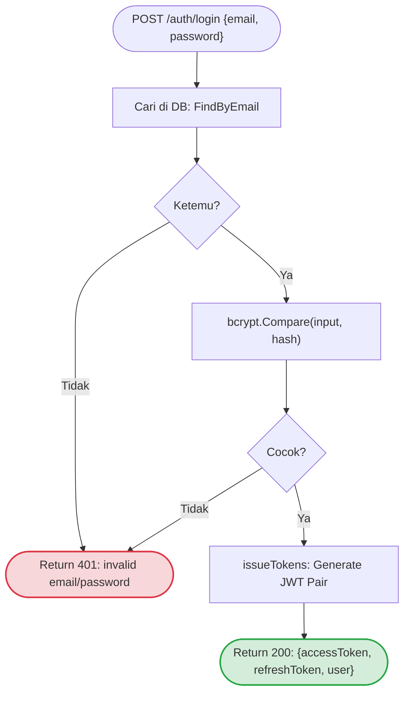
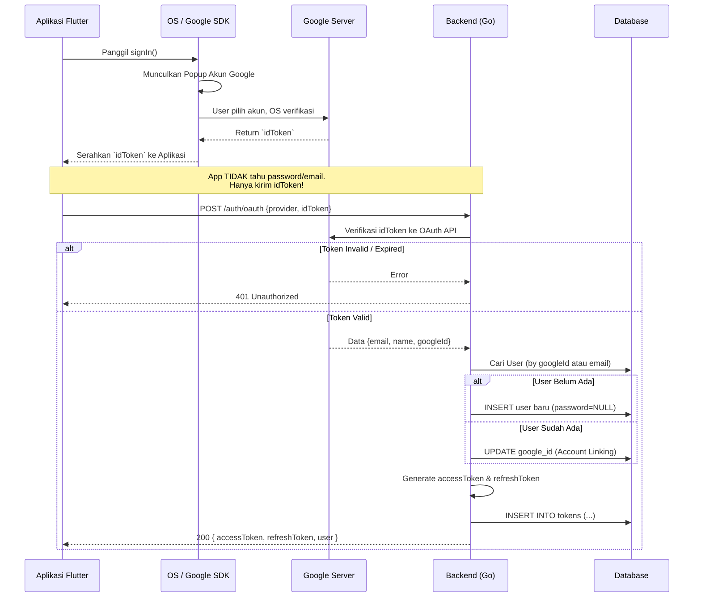
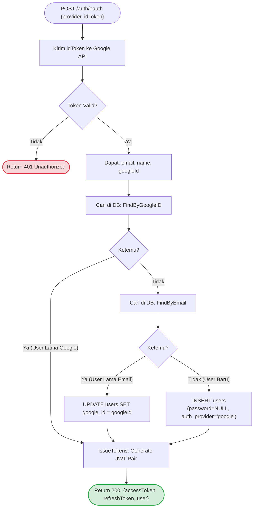
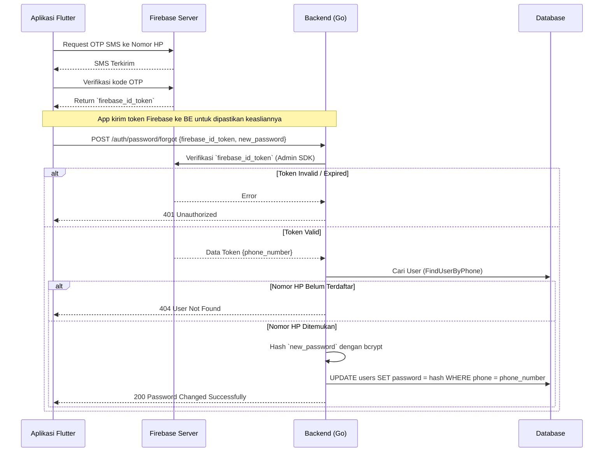
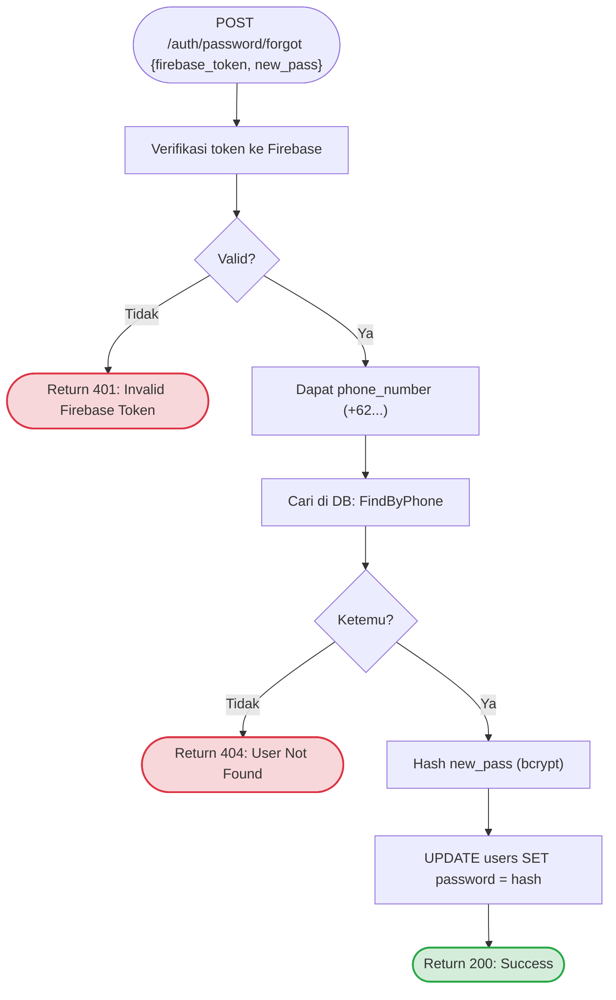

# Authentication Architecture & Logic

## 1. Bagaimana Token Bekerja (Fondasi)

1. User login → BE verifikasi credential → BE buat JWT pair
2. JWT pair disimpan di tabel `tokens` (BE) DAN di SecureStorage (HP)
3. Setiap request ke protected endpoint:
   - HP kirim: `Authorization: Bearer <accessToken>`
   - BE match token dengan DB → valid → proses request
4. `accessToken` expired (15 menit):
   - HP kirim `refreshToken` ke `POST /auth/refresh`
   - BE revoke token lama di DB → issue token pair baru
   - HP simpan token baru, lanjut request
5. `refreshToken` expired (7 hari) → paksa logout → user login ulang

> Password di DB adalah **bcrypt hash**, bukan teks asli.
> BE tidak pernah tahu password asli — hanya membandingkan hash.

### Visualisasi Penyimpanan Token

Setelah login sukses, token disimpan di dua tempat:

**1. Di Database (Backend):** Tabel `tokens`
| id | user_id | access_token | refresh_token | is_revoked | access_expiry |
|----|---------|--------------|---------------|------------|---------------|
| 1  | 10      | `eyJhbG...`  | `eyJhbG...`   | `false`    | `10:15:00`    |

**2. Di SecureStorage (HP/Client):**
| Key | Value |
|-----|-------|
| `access_token` | `eyJhbG...` |
| `refresh_token` | `eyJhbG...` |

---

## 2. Email/Password Login — Internal Flow

### 2.1. Sequence Diagram (Interaksi Komponen)


### 2.2. Flowchart Logic (Logika Percabangan)


---

## 3. Google Sign-In — Internal Flow (Planned)

Perbedaan mendasar: **Google yang memverifikasi identitas**, bukan BE.
`idToken` adalah "surat keterangan dari Google" yang berisi: *email, name, googleId*.
BE memvalidasi surat ini ke server Google — tidak ada password yang dicek.

### 3.1. Sequence Diagram (Interaksi Komponen)


### 3.2. Flowchart Logic (Logika Percabangan)


> Setelah dapat `accessToken` dari BE, HP menyimpan dan menggunakannya
> **persis sama** seperti login email/password. Client tidak perlu tahu
> user login via metode apa — semuanya transparan.

---

## 4. DB Migration untuk Google Sign-In

```sql
-- Migration: 011_add_oauth_support.sql

-- 1. password jadi nullable (Google user tidak punya password)
ALTER TABLE users ALTER COLUMN password DROP NOT NULL;
ALTER TABLE users ALTER COLUMN password SET DEFAULT NULL;

-- 2. simpan Google ID untuk lookup returning user
ALTER TABLE users ADD COLUMN IF NOT EXISTS
    google_id VARCHAR(255) UNIQUE DEFAULT NULL;

-- 3. track metode registrasi
ALTER TABLE users ADD COLUMN IF NOT EXISTS
    auth_provider VARCHAR(20) NOT NULL DEFAULT 'local';

ALTER TABLE users ADD CONSTRAINT chk_auth_provider
    CHECK (auth_provider IN ('local', 'google', 'apple', 'github'));

CREATE INDEX IF NOT EXISTS idx_users_google_id ON users (google_id);
```

**Kolom baru di tabel `users`:**

| Kolom | Tipe | Keterangan |
|-------|------|------------|
| `password` | TEXT **NULL** | Diubah dari NOT NULL — NULL untuk social user |
| `google_id` | VARCHAR(255) UNIQUE NULL | `sub` dari Google idToken |
| `auth_provider` | VARCHAR(20) DEFAULT 'local' | `local` / `google` / `apple` / `github` |

---

## 5. Lupa Password (Forgot Password) via Firebase OTP

Fitur ini mengizinkan pengguna yang tidak bisa login (lupa password) untuk mereset password mereka dengan melakukan verifikasi nomor HP menggunakan **Firebase Phone Auth** (OTP SMS). Ini adalah API Public (tanpa Bearer Token) karena user dalam kondisi belum login.

### 5.1. Syarat Infrastruktur
- Menggunakan **Firebase Admin SDK** di Backend Go (`firebase.google.com/go/v4`).
- Tabel `users` wajib memiliki kolom `phone` yang terisi dengan format E.164 (contoh: `+628111111111`).

### 5.2. Sequence Diagram (Interaksi Komponen)



### 5.3. Flowchart Logic



